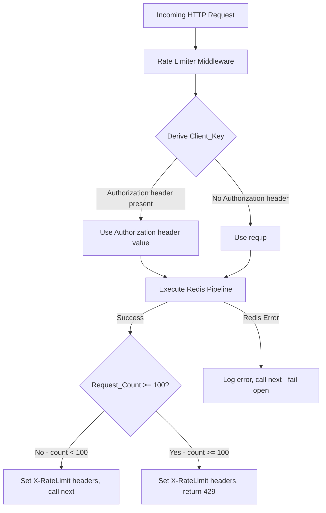
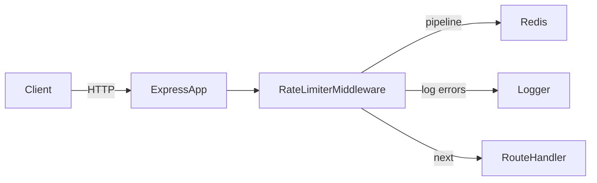

# Design Document: Rate Limiter Middleware

## Overview

This document describes the technical design for a rate limiter middleware component for Express.js. The middleware enforces a per-client sliding window quota of 100 requests per 60 seconds. It uses Redis Sorted Sets to track request timestamps with millisecond precision, allowing accurate counting across multiple API server instances. Clients are identified by their Authorization token (when present) or by their IP address as a fallback. When a client exhausts its quota the middleware short-circuits the request with an HTTP 429 response. Standard `X-RateLimit-*` headers are attached to every processed response so clients can self-throttle. The component is designed to fail-open: if Redis is unavailable the middleware logs the error and passes the request through without applying limits.

---

## Architecture

### High-Level Flow



### Component Placement

The middleware sits between the Express router and all route handlers. It is registered once at the application level (or per-router as needed). It depends on two external services: the Redis client (injected via factory or module-level singleton) and a logger.



---

## Components and Interfaces

### `rateLimiter` Middleware Factory

The primary export is a factory function that returns an Express middleware function. Using a factory allows dependency injection of the Redis client and logger, which is essential for unit testing.

```typescript
// src/middleware/rateLimiter.ts

import { Request, Response, NextFunction } from 'express';
import { RedisClientType } from 'redis'; // or ioredis equivalent

export interface RateLimiterOptions {
  redisClient: RedisClient;    // injected Redis client instance
  logger: Logger;              // injected logger (e.g. winston, pino)
  limit?: number;              // default: 100
  windowMs?: number;           // default: 60000 (60 seconds)
  ttlSeconds?: number;         // default: 70
}

export interface Logger {
  error(message: string, ...meta: unknown[]): void;
}

export interface RedisClient {
  pipeline(): RedisPipeline;
}

export interface RedisPipeline {
  zadd(key: string, score: number, member: string): this;
  zremrangebyscore(key: string, min: string, max: number): this;
  zcard(key: string): this;
  expire(key: string, seconds: number): this;
  exec(): Promise<Array<unknown>>;
}

/**
 * Creates and returns an Express rate-limiter middleware.
 */
export function createRateLimiter(options: RateLimiterOptions): 
  (req: Request, res: Response, next: NextFunction) => Promise<void>;
```

### `deriveClientKey` Helper

A pure function extracted from the middleware for direct unit testing.

```typescript
/**
 * Returns the Authorization header value if present,
 * otherwise falls back to req.ip.
 */
export function deriveClientKey(req: Request): string;
```

### `buildRateLimitHeaders` Helper

A pure function that computes the three header values given the current sliding window state.

```typescript
export interface RateLimitState {
  limit: number;
  requestCount: number;
  oldestTimestampMs: number | null; // null when window is empty
  nowMs: number;
}

export interface RateLimitHeaders {
  'X-RateLimit-Limit': string;
  'X-RateLimit-Remaining': string;
  'X-RateLimit-Reset': string;
}

/**
 * Computes X-RateLimit-* header values from current window state.
 * When oldestTimestampMs is null (no prior requests), Reset = floor(nowMs/1000) + 60.
 */
export function buildRateLimitHeaders(state: RateLimitState): RateLimitHeaders;
```

---

## Data Models

### Redis Key Schema

| Field | Value |
|---|---|
| Key | `<Client_Key>` (verbatim Authorization header value or IP address) |
| Type | Redis Sorted Set |
| Member | Unix timestamp in milliseconds as a string (e.g. `"1700000000123"`) |
| Score | Same Unix timestamp in milliseconds (float) |
| TTL | 70 seconds, refreshed on every request |

Because multiple requests can arrive at the exact same millisecond, members must be unique. A safe approach is to append a short random suffix to the member string while keeping the score as the raw millisecond timestamp.

```
Member format: "<timestamp_ms>:<random_4_hex_chars>"
Score:         <timestamp_ms>  (numeric, millisecond precision)
```

### Pipeline Execution Order

The following four commands execute atomically in a single pipeline call:

1. `ZADD <key> <now_ms> "<now_ms>:<nonce>"` — record current request
2. `ZREMRANGEBYSCORE <key> -inf <(now_ms - 60000)>` — prune expired members
3. `ZCARD <key>` — read updated count
4. `EXPIRE <key> 70` — refresh TTL

The result of `ZCARD` (index 2 in `exec()` results) is the `Request_Count` used for the allow/block decision.

### Reset Time Calculation

After pruning, the oldest surviving member's score is obtained via `ZRANGE <key> 0 0 WITHSCORES`. To avoid an extra round-trip this can be pipelined or fetched in a second pipeline call only when needed for header construction.

A simpler and more performant approach: include `ZRANGE key 0 0 WITHSCORES` as a fifth command in the same pipeline.

```
Reset_Time = floor(oldest_score_ms / 1000) + 60
```

When the sorted set is empty (first request ever for this client, or all prior entries expired):

```
Reset_Time = floor(now_ms / 1000) + 60
```

### HTTP 429 Response Body

```json
{
  "message": "Too many requests. You have exceeded the rate limit of 100 requests per 60 seconds. Please retry after the reset time indicated in the X-RateLimit-Reset header."
}
```

---

## Correctness Properties

*A property is a characteristic or behavior that should hold true across all valid executions of a system — essentially, a formal statement about what the system should do. Properties serve as the bridge between human-readable specifications and machine-verifiable correctness guarantees.*

### Property 1: Client Key Derivation Priority

*For any* HTTP request, the derived Client_Key SHALL equal the full `Authorization` header value when that header is present, and SHALL equal `req.ip` when the `Authorization` header is absent. There is no input for which both conditions hold simultaneously.

**Validates: Requirements 1.1, 1.2**

---

### Property 2: Allow/Block Decision Threshold

*For any* Redis pipeline result where `Request_Count` is in the range `[0, 99]`, the middleware SHALL call `next()` and allow the request to proceed. *For any* `Request_Count >= 100`, the middleware SHALL respond with HTTP 429 and SHALL NOT call `next()`.

**Validates: Requirements 2.1, 2.4, 2.5, 3.1**

---

### Property 3: Sliding Window Pruning Invariant

*For any* sorted set of request timestamps and any current time `now_ms`, after executing `ZREMRANGEBYSCORE key -inf (now_ms - 60000)`, no remaining member in the set SHALL have a score less than `(now_ms - 60000)`. The surviving member count plus the newly added request represents the accurate Request_Count for the current window.

**Validates: Requirements 2.3**

---

### Property 4: Remaining Header Formula

*For any* `Request_Count` in the range `[0, ∞)`, the `X-RateLimit-Remaining` header value SHALL equal `max(0, 100 - Request_Count)`. Specifically: for counts below 100 the value decreases linearly; for counts at or above 100 the value is clamped to 0.

**Validates: Requirements 4.2**

---

### Property 5: Reset Header Formula

*For any* non-empty sorted set, the `X-RateLimit-Reset` header SHALL equal `floor(oldest_member_score_ms / 1000) + 60`. When the sorted set is empty (no prior requests recorded), the header SHALL equal `floor(now_ms / 1000) + 60`.

**Validates: Requirements 4.3, 4.4**

---

### Property 6: Fail-Open Behavior

*For any* request where the Redis pipeline throws an error, the middleware SHALL call `next()`, SHALL NOT set `X-RateLimit-Limit`, `X-RateLimit-Remaining`, or `X-RateLimit-Reset` headers, and SHALL NOT return a 429 response. The error SHALL be passed to the logger.

**Validates: Requirements 6.1, 6.2, 6.3**

---

## Error Handling

### Redis Unavailability

The entire Redis pipeline is wrapped in a `try/catch`. On any thrown error:

1. `logger.error('Rate limiter Redis error', { error: err.message, clientKey })` is called.
2. `next()` is called immediately — the request proceeds to the route handler.
3. No `X-RateLimit-*` headers are set.
4. The original error is never forwarded to the HTTP response.

This is the fail-open pattern: degraded observability is preferred over API unavailability.

### Invalid or Missing `req.ip`

If `req.ip` is `undefined` (misconfigured proxy or test environment), the middleware falls back to the string `"unknown"` as the Client_Key to avoid a Redis key of `undefined`.

### Redis Pipeline Partial Failures

`pipeline().exec()` may return `null` results for individual commands. The implementation must guard against `null` returns from `ZCARD` (treat as 0) and from `ZRANGE` (treat as empty, use `now + 60` for reset time).

### Uncaught Async Errors

The middleware function is `async`. The Express error boundary does not automatically catch rejected promises unless the rejection is passed to `next(err)`. The implementation wraps the body in `try/catch` and calls `next(err)` only for unexpected, non-Redis errors (to preserve the fail-open contract for Redis failures).

---

## Testing Strategy

### Dual Testing Approach

This feature uses both **unit tests** (example-based, mocked Redis) and **property-based tests** to achieve comprehensive coverage.

- Unit tests cover specific scenarios, edge cases, integration between helpers, and pipeline command verification.
- Property-based tests verify the six correctness properties across randomly generated inputs.

### Property-Based Testing Library

**Library:** [fast-check](https://fast-check.dev/) (JavaScript/TypeScript, well-maintained, widely adopted)

Each property test runs a minimum of **100 iterations**.

Tag format for each property test:
```
// Feature: rate-limiter-middleware, Property <N>: <property_text>
```

### Property Test Implementations

| Property | Input Generators | Assertion |
|---|---|---|
| P1: Client Key | `fc.string()` for header value, `fc.ipV4()` / `fc.ipV6()` for IP | `deriveClientKey` returns correct key |
| P2: Allow/Block | `fc.integer({ min: 0, max: 200 })` for count | count < 100 → `next()` called; count >= 100 → 429 returned |
| P3: Pruning Invariant | Array of `fc.integer()` timestamps, `fc.date()` for now | No member score < `(now_ms - 60000)` after prune |
| P4: Remaining Formula | `fc.integer({ min: 0, max: 200 })` for count | Header = `max(0, 100 - count)` |
| P5: Reset Formula | `fc.integer({ min: 1, max: 10 })` for set size, timestamps | Header = `floor(min_score/1000) + 60` |
| P6: Fail-Open | Any request shape, Redis mock throws | `next()` called, no rate-limit headers |

### Unit Test Scenarios

```
describe('rateLimiter middleware')
  ├── Client Key Derivation
  │   ├── uses Authorization header when present
  │   ├── falls back to req.ip when Authorization absent
  │   └── uses 'unknown' when both are absent/undefined
  ├── Allow Path (count < 100)
  │   ├── calls next()
  │   ├── sets X-RateLimit-Limit: 100
  │   ├── sets X-RateLimit-Remaining: 100 - count
  │   └── sets X-RateLimit-Reset correctly
  ├── Block Path (count >= 100)
  │   ├── returns status 429
  │   ├── sets Content-Type: application/json
  │   ├── includes message in JSON body
  │   └── sets correct X-RateLimit headers
  ├── Redis Pipeline
  │   ├── calls ZADD with ms timestamp as score
  │   ├── calls ZREMRANGEBYSCORE with correct window bounds
  │   ├── calls ZCARD
  │   └── calls EXPIRE with 70s TTL
  ├── Fail-Open
  │   ├── calls next() on Redis error
  │   ├── does NOT set X-RateLimit headers on error
  │   └── logs error via logger.error
  └── Edge Cases
      ├── first request for client (empty set → reset = now + 60)
      └── count exactly at boundary (99 → allow, 100 → block)
```

### Mock Strategy

The Redis client is injected via the factory function. Tests construct a mock pipeline object:

```typescript
const mockPipeline = {
  zadd: jest.fn().mockReturnThis(),
  zremrangebyscore: jest.fn().mockReturnThis(),
  zcard: jest.fn().mockReturnThis(),
  zrange: jest.fn().mockReturnThis(),
  expire: jest.fn().mockReturnThis(),
  exec: jest.fn().mockResolvedValue([null, null, count, null, oldestEntry]),
};
const mockRedis = { pipeline: jest.fn(() => mockPipeline) };
```

This approach requires no live Redis instance and runs in CI without external dependencies.

### Test Runner and Configuration

- **Framework:** Jest (standard for Express/Node projects) or Vitest
- **Property Testing:** fast-check (^3.x)
- **Minimum iterations:** 100 per property test (`fc.assert(fc.property(...), { numRuns: 100 })`)
- **Coverage target:** 100% line coverage on `rateLimiter.ts`, `deriveClientKey.ts`, and `buildRateLimitHeaders.ts`
